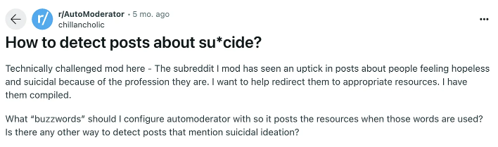

## Background

Algospeak refers to language that has been created, adopted, or modified to a) evade moderation detection, b) possibly reduce negativity of words uses online that might trigger past trauma events, memories.

### Moderation

In communities where posters are anonymous, there can be a sound reason to attempt to flag content that either violates terms of service or that might indicate that someone is a possible harm to themselves or others.

### 

### Trigger and Content Warnings

The present research aims to see whether describing a death by suicide as 'unalived' *takes away* from the severity and seriousness of the act itself.

> "Kurt Cobain un-alived himself at 27, placing him in the company of other artists who passed at that same age under tragic circumstances, such as Jimi Hendrix, Janis Joplin, and Jean-Michel Basquiat" – Museum of Pop Culture

### Characteristics of Algospeak

Algospeak combines several elements of *textisms* that either modify how a word is pronounced or read.

-   Letter substitution

    -   c00l instead of cool

-   Reductions

    -   i c u instead of I see you

-   Initialisms

    -   lol in place of laugh out lous

-   Spelling Variations

    -   gimme instead of give me

## Algospeak Examples

```{r}
#| message: false
#| warning: false


library(gt)
library(tidyverse)

alg <- read.csv("algospeak - algospeak_mapping.csv")

alg %>% 
  gt() %>% 
  tab_header(
    title = md("**List of Algospeak Words as Identified by Steen et al. (2023)**"),
    subtitle = md("*Twenty Algospeak items were emoji and not included in the study design*")
  ) %>% 
  opt_interactive()

```

## Hypotheses

H~1~: Statements containing algospeak will be interpreted differently than equivalent statements using standard language.

H~2~: Algospeak will influence perceived severity and intent of sensitive statements.

IV~1~: Algospeak lexicon DV1: Rated valence and meaning of words

IV~2~: Algospeak lexicon DV2: Rated severity of statements

### References:

Bury, B. (2025). Decoding Algospeak: Unveiling the Patterns of Linguistic Evolution in the Digital Age. Lorenz, T. (2022). Internet ‘algospeak’ is changing our language in real time, from ‘nip nops’ to ‘le dollar bean’.The Washington Post

Schock, B., Kuraner, S. E., Westphal, M., & Bonanno, G. A. (2025). How “algospeak” is changing online discourse on suicide and self-harm: A pilot study. Traumatology

Steen, E., Yurechko, K., & Klug, D. (2023). You can (not) say what you want: Using algospeak to contest and evade algorithmic content moderation on TikTok. Social Media+ Society, 9(3), 20563051231194586.
