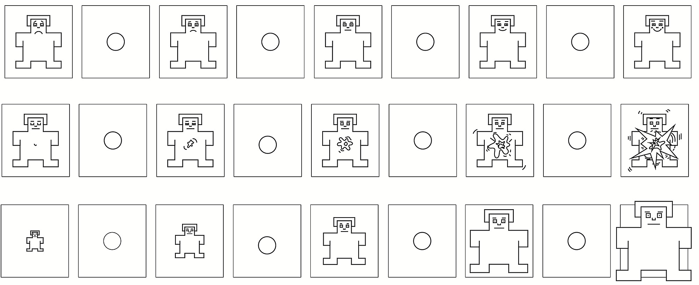

## Background

## Image Descriptions

All images were taken from [OASIS: Open Affective Standardized Image Set](https://osf.io/6pnd7/overview)

The OASIS dataset contains 900 images that are categorized by theme, valence, category description, and arousal.

### Image Categories

```{r}
#| warning: false
#| message: false

library(gt)
library(tidyverse)


os <- read.csv("OASIS.csv")

os %>% 
  count(Category, sort = TRUE) %>% 
  gt() %>% 
  tab_header(
    title = md("**Image Categorization in OASIS Image Set**")
  )
```

## Image Selection Criteria

-   **Negative** Images were selected that were low in valence and high in arousal

-   **Positive** Images were selected that were both high in valence and high in arousal

-   **Neutral** Images were selected that were low in arousal

```{r}
os %>% 
  arrange(Valence_mean) %>% 
  select(Theme, Category, Valence_mean, Arousal_mean) %>% 
  gt() %>% 
  fmt_auto() %>% 
  opt_interactive(use_sorting = TRUE)
```

## Image Description

```{r}


stim <- read.csv("Copy of stimList.xlsx - stimList.csv") 

stim %>% 
  select(neutral, negative, positive) %>% 
  gt() %>% 
  tab_header(
    title = md("**Image Descriptions from OASIS**"),
    subtitle = md("*Verbatim Visual Description*")
  )
```

## Image Example

::: {#fig-elephants layout-ncol="3"}


OASIS Examples
:::

## Instruments

### Morbid Curiosity Scale

Developed by Scrivner \@article{scrivner2021psychology, title={The psychology of morbid curiosity: Development and initial validation of the morbid curiosity scale}, author={Scrivner, Coltan}, journal={Personality and individual differences}, volume={183}, pages={111139}, year={2021}, publisher={Elsevier} }

```{=html}
<iframe width="100%" height="500" src="https://ssd.az1.qualtrics.com/jfe/form/SV_9GLAOrmsjMfthg9" title="External Webpage"></iframe>
```

## Disgust Sensitivity Scale

```         
@article{olatunji2007disgust,   title={The Disgust Propensity and Sensitivity Scale-Revised: Psychometric properties and specificity in relation to anxiety disorder symptoms},   author={Olatunji, Bunmi O and Cisler, Josh M and Deacon, Brett J and Connolly, Kevin and Lohr, Jeffrey M},   journal={Journal of Anxiety Disorders},   volume={21},   number={7},   pages={918--930},   year={2007},   publisher={Elsevier} }
```

```{=html}
<iframe width = "100%" height = "500" src="https://farmingdale.qualtrics.com/jfe/form/SV_3Kl0XGdUEZNLwpg"></iframe>
```

## Self Assessment Manikin (SAM)

```         
@article{bradley1994measuring,   title={Measuring emotion: the self-assessment manikin and the semantic differential},   author={Bradley, Margaret M and Lang, Peter J},   journal={Journal of behavior therapy and experimental psychiatry},   volume={25},   number={1},   pages={49--59},   year={1994},   publisher={Elsevier} }
```



## Digital Poster


