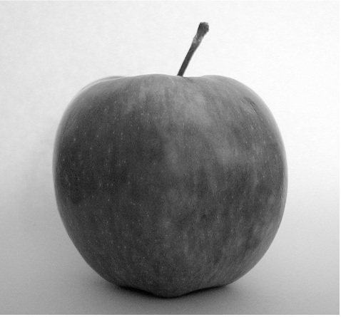

## Background

-   **Study Framework:** Based on Bridgland et al. (2022), examining avoidance behaviors, the efficacy of warnings, and “morbid curiosity” as a potential coping mechanism for anxiety.

-   **Trigger Warnings and Avoidance:** Bridgland et al. (2022) found that trigger warnings did not significantly influence avoidance behavior, suggesting limited effectiveness.

-   **Anxiety Measurement:** Utilizes the Spielberger State-Trait Anxiety Inventory (STAI) to assess both state and trait anxiety levels.

-   **Research Focus:** The efficacy of trigger warnings and content warnings on sensitive content.

-   **Research Finding:** Trigger warnings were ineffective and did not significantly affect responses to negative material.

-   **Research Source:** Bridgland, et al. 2023.

## Stimuli

Stimuli were taken from Google searches using keywords such as '*violent*', '*disgusting*' and '*neutral*'.

::: {#blurry layout-ncol="3"}
{width="320"}

{width="313"}

{width="306"}
:::

## Hypotheses

H~1~: Participants higher in morbid curiosity will choose to unblur the image more than those who score lower in morbid curiosity

H~2~: Participants will, on average, choose to view more pictures when they are presented with a trigger warning compared to when they are not.

H~3~: Participants will choose to view more images in the Graphic conditions compared to the Control/Neutral condition.

## References

-   Bridgland, V. M. E., & Takarangi, M. K. T. (2021). Something Distressing This Way Comes: The Effects of Trigger Warnings on Avoidance Behaviors in an Analogue Trauma Task. Behavior Therapy, 53(3)

-   Bridgland, V., Jones, P. J., & Bellet, B. W. (2023). A Meta-Analysis of the Efficacy of Trigger Warnings, Content Warnings, and Content Notes. Clinical Psychological Science, 12(4)

-   Bellet, B. W., Jones, P. J., & McNally, R. J. (2018). Trigger warning: Empirical evidence ahead. Journal of Behavior Therapy and Experimental Psychiatry, 61, 134–141

-   Jones, P. J., Bellet, B. W., & McNally, R. J. (2020). Helping or harming? The effect of trigger warnings on individuals with trauma histories. Clinical Psychological Science, 8(5), 905–917

-   Nolan, H., & Roberts, L. (2023). Trigger warnings as tools for learning—theorising an evolving cultural concept. Medical Education, 58(2).
